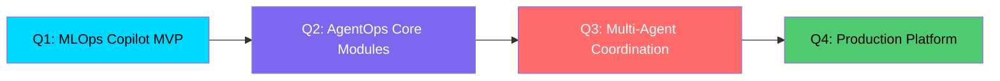

# <div align="center">👨‍💻 Sagar Pallai</div>

<div align="center">
  
  ```
  ╔══════════════════════════════════════════════════════════════════╗
  ║                                                                  ║
  ║   🧠 AI Agent Architect  ·  🔧 MLOps Engineer  ·  🔬 ML Builder  ║
  ║                                                                  ║
  ╚══════════════════════════════════════════════════════════════════╝
  ```

  <p>
    
  </p>

  <a href="https://twitter.com/SagarPallai"></a>
  <a href="https://medium.com/@sagarpallai1997"></a>
  <a href="https://github.com/sagar431"></a>

</div>

<br>


##  What I'm Building

<table>
<tr>
<td width="50%">

### 🤖 MLOps Copilot

> *"Deploy ResNet50" → Automatic Deployment Pipeline*

Building a natural language interface for MLOps automation. Imagine saying "deploy my model to production" and watching the entire pipeline execute autonomously.

```yaml
Architecture:
  ├── Understanding Layer (Command Interpreter)
  ├── Execution Layer
  │   ├── Traditional ML Pipeline
  │   └── Agentic Systems Pipeline  
  └── Infrastructure Layer (Unified)
```

**Core Innovation:** Treating traditional ML models as "zero-autonomy agents" within a unified AgentOps framework.

</td>
<td width="50%">

### 🧬 AgentOps Platform

> *The Next Evolution Beyond MLOps*

Designing infrastructure for autonomous AI systems with 12 core modules:

```
┌─────────────────────────────────────┐
│  🎯 Agent Lifecycle Management      │
│  🧠 Memory Infrastructure           │
│  📊 Cognitive Load Monitoring       │
│  🔄 Multi-Agent Coordination        │
│  ⚡ Perception → Memory → Decision  │
│     → Action Loop                   │
└─────────────────────────────────────┘
```

**Philosophy:** Same production rigor for agent reasoning as model predictions.

</td>
</tr>
</table>

<br>

##  Tech Stack

<div align="center">

| Domain | Technologies |
|--------|-------------|
| **🤖 Agent Framework** | `FastMCP` `Pydantic` `Multi-MCP Architecture` `Structured Reasoning` |
| **🔧 MLOps** | `Docker` `Kubernetes` `DVC` `Weights & Biases` `Prometheus` |
| **☁️ Cloud & Infra** | `AWS` `Lambda` `EKS` `Render` `Vercel` |
| **🧠 AI/ML** | `PyTorch` `Transformers` `FAISS` `Ollama` `CUDA` |
| **💾 Data & Storage** | `PostgreSQL` `Pinecone` `Redis` `Vector DBs` |

</div>

<br>

<div align="center">
  
</div>

<br>

## 🔬 Current Deep Dives

<div align="center">

```
┌────────────────────────────────────────────────────────────────────────┐
│                                                                        │
│   📚 Training Models from Scratch                                      │
│   ├── Understanding every gradient, every weight update                │
│   ├── CUDA optimization & GPU computing fundamentals                   │
│   └── Making deep learning "go brrrr" from first principles           │
│                                                                        │
│   🏗️ Building AI Agents                                                │
│   ├── Perception → Memory → Decision → Action loops                   │
│   ├── Tool use & MCP server architecture                              │
│   └── Cognitive monitoring & memory versioning                        │
│                                                                        │
│   ⚙️ Production MLOps                                                  │
│   ├── Config-driven architecture (behavior via YAML, not code)        │
│   ├── A/B testing & reproducible experiments                          │
│   └── Unified infrastructure for models + agents                      │
│                                                                        │
└────────────────────────────────────────────────────────────────────────┘
```

</div>

<br>

## 📂 Featured Work

<div align="center">

<table>
<tr>
<td align="center" width="33%">

### 🧠 Cortex-R Agent

Multi-MCP server architecture with modular perception/decision/action modules

`Python` `FastMCP` `Pydantic`

</td>
<td align="center" width="33%">

### 🚀 MLOps Pipeline

End-to-end deployment automation with natural language commands

`Docker` `K8s` `AWS Lambda`

</td>
<td align="center" width="33%">

### 📊 Agent Monitoring

Prometheus metrics for both accuracy & cognitive load

`Prometheus` `W&B` `DVC`

</td>
</tr>
</table>

</div>

<br>

## 💡 Design Principles

```python
class SagarPhilosophy:
    """Core principles that guide my engineering approach"""
    
    principles = {
        "agents_are_ml_apps": "Same production rigor for reasoning as predictions",
        "config_driven": "Change behavior via YAML, not code",
        "unified_infrastructure": "Traditional models = zero-autonomy agents",
        "80_20_rule": "Focus on core functionality, AI for boilerplate",
        "structured_reasoning": "[PREREQ_CHECK] → [TOOL_SELECT] → [VALIDATION]"
    }
    
    def build(self, idea):
        return self.document_first() \
               .then(self.mvp_in_8_weeks()) \
               .then(self.production_polish())
```

<br>

## 📈 GitHub Stats

<div align="center">
  
  
</div>

<br>

<div align="center">
  
</div>

<br>

## 🎯 2025 Roadmap



<br>

## 📬 Let's Connect

<div align="center">

*Building the bridge between MLOps and autonomous AI systems.*

*If you're working on AI agents, MLOps automation, or training models from scratch — let's talk!*

<br>

<a href="mailto:sagarpallai1997@gmail.com">
  
</a>

<a href="https://twitter.com/SagarPallai">
  
</a>

<br><br>


</div>

<br>


<div align="center">
  <sub>🔧 Built with passion for AI systems that actually work in production</sub>
</div>
